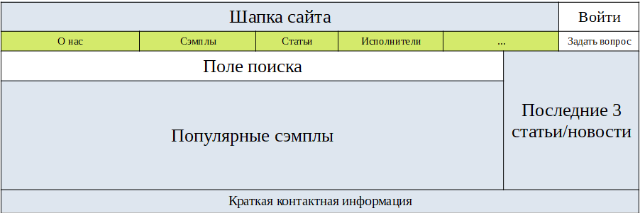
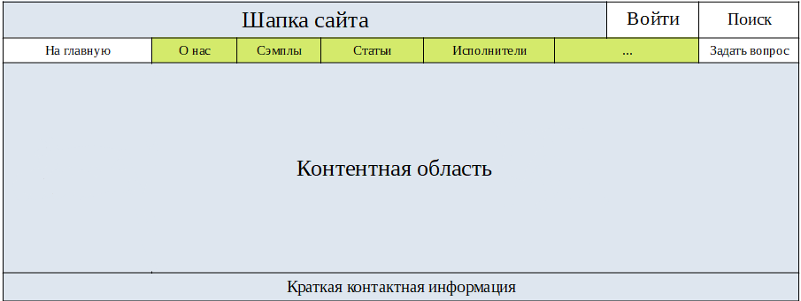
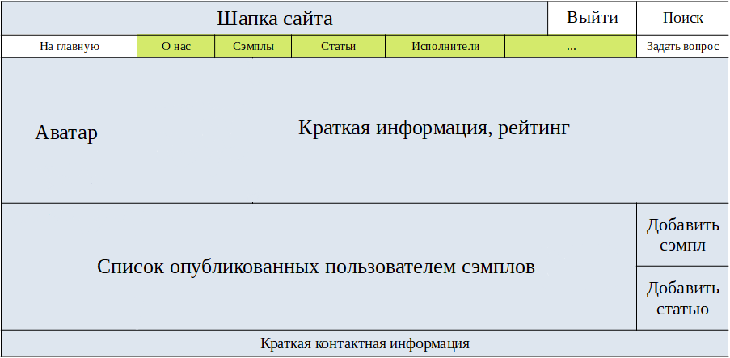
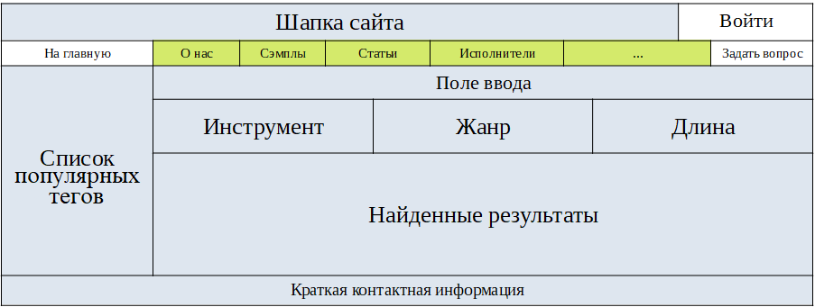
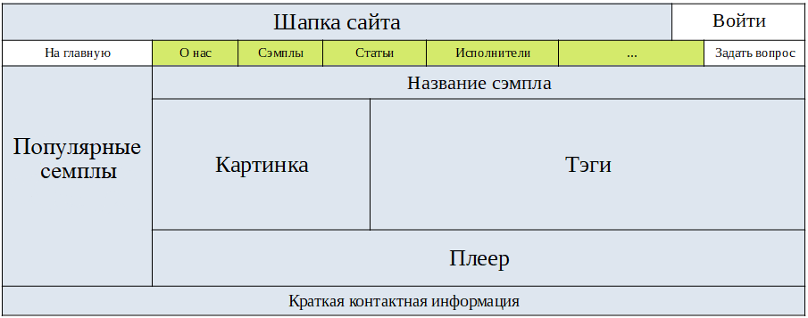
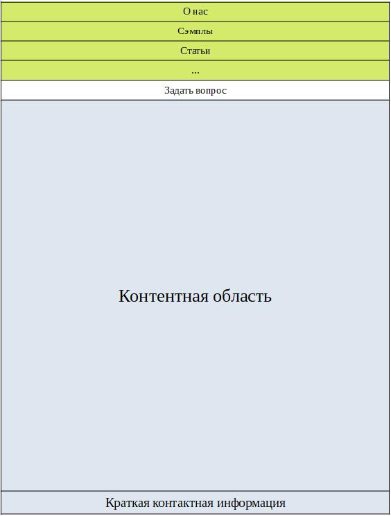
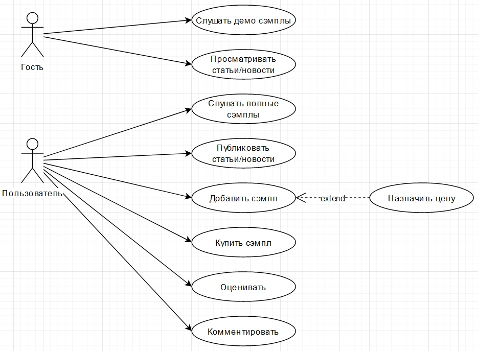
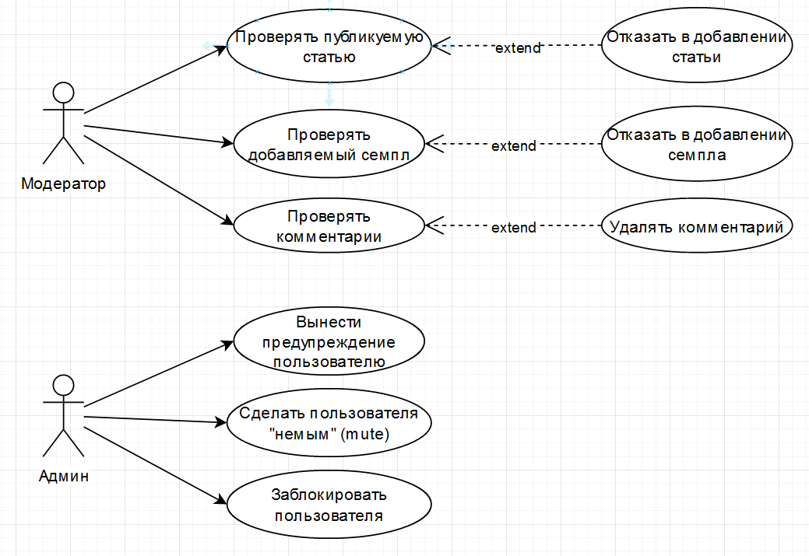
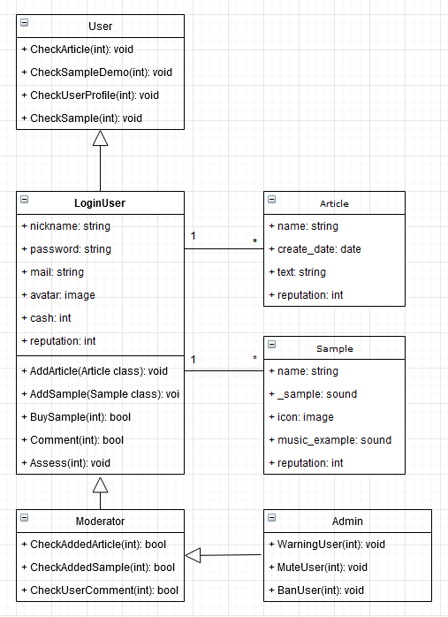

# Технический Проект
### Макеты сайта

Рис. 1 - Пример размещения элементов главной страниц

Рис. 2 - Пример размещения элементов внутренних страниц сайта

Рис. 3 - Пример личного кабинета пользователя

Рис. 4 - Пример окна поиска по сэмплов

Рис. 5 - Пример окна просмотра сэмпла

Рис. 6 - Пример мобильной версии сайта. Разделы скрыты

Рис. 7 - Пример мобильной версии сайта. Разделы раскрыты

### UML Диаграммы

Рис. 8 - Диаграмма прецедентов гость/пользователь

Рис. 9 - Диаграмма прецедентов модератор/админ

Рис. 10 - Диаграмма классов

### Диаграмма Ганта

Рис. 11 - Диаграмма Ганта

### Agile доска

Рис. 12 - Agile доска

## Рейтинг

Топ сэмплов формируется на основе оценок пользователей и по количеству скачиваний:
топКоэффициент = количествоСкачиваний * 2 + суммарнаяОценка;

## Поиск и теги

Упростить поиск подходящих семплов помогут теги. У каждого семпла есть свой тег, который относит его к определенному жанру, типу звука или инструменту. Теги можно искать через поиск и вам выдадут все возможные результаты по данному запросу. Так же, все теги кликабельны, нажав на определенный тег вы перейдете в раздел с семплами этой этой категории. Так же семплы можно искать через имена авторов.